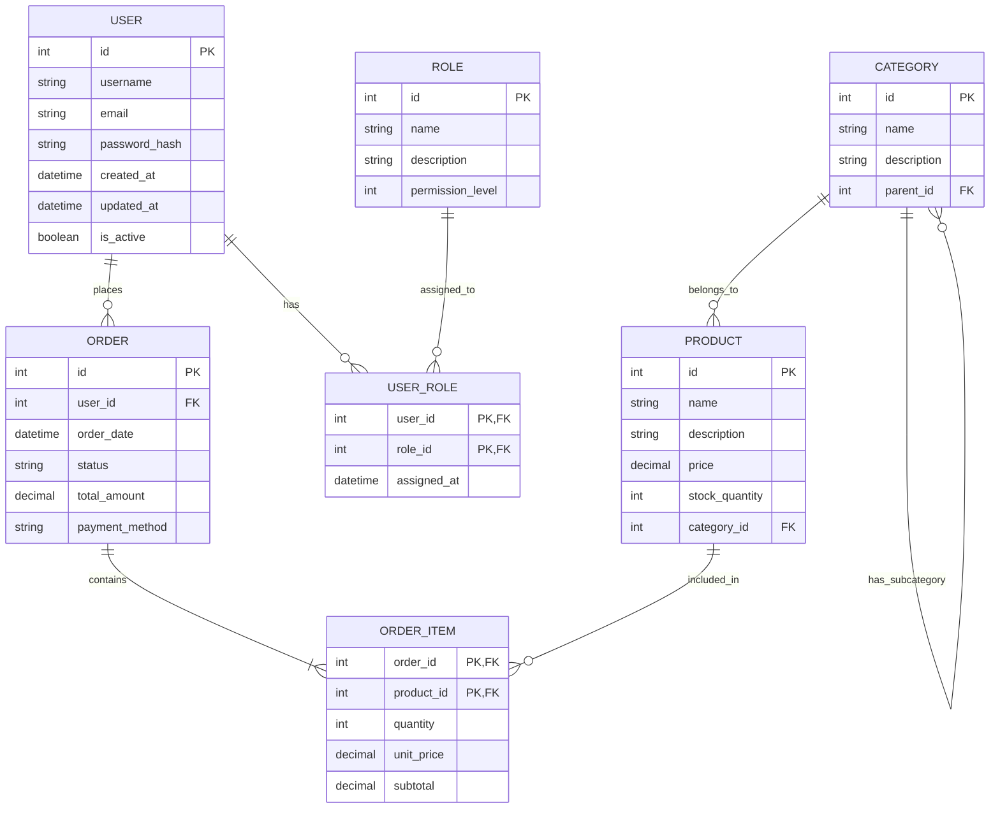

# データベース設計

このセクションでは、システムのデータベース設計について詳細に記載します。

## データベース概要

システムでは以下のデータベースを使用します：

1. **メインデータベース** - アプリケーションの主要データを格納
2. **分析用データベース** - レポート生成や分析用のデータを格納
3. **ログデータベース** - システムログやアクセスログを格納

## ER図

以下はシステムの主要エンティティとその関連を示すER図です：

## テーブル定義

### users テーブル

| カラム名 | データ型 | NULL | 主キー | 外部キー | デフォルト | 説明 |
|---------|---------|------|-------|----------|----------|------|
| id | INTEGER | NO | YES | - | - | ユーザーID |
| username | VARCHAR(50) | NO | - | - | - | ユーザー名 |
| email | VARCHAR(100) | NO | - | - | - | メールアドレス |
| password_hash | VARCHAR(255) | NO | - | - | - | パスワードハッシュ |
| first_name | VARCHAR(50) | YES | - | - | NULL | 名 |
| last_name | VARCHAR(50) | YES | - | - | NULL | 姓 |
| created_at | TIMESTAMP | NO | - | - | CURRENT_TIMESTAMP | 作成日時 |
| updated_at | TIMESTAMP | YES | - | - | NULL | 更新日時 |
| is_active | BOOLEAN | NO | - | - | TRUE | アクティブ状態 |

**インデックス**
- PRIMARY KEY (id)
- UNIQUE INDEX (email)
- INDEX (username)

### roles テーブル

| カラム名 | データ型 | NULL | 主キー | 外部キー | デフォルト | 説明 |
|---------|---------|------|-------|----------|----------|------|
| id | INTEGER | NO | YES | - | - | ロールID |
| name | VARCHAR(50) | NO | - | - | - | ロール名 |
| description | VARCHAR(255) | YES | - | - | NULL | 説明 |
| permission_level | INTEGER | NO | - | - | 0 | 権限レベル |

**インデックス**
- PRIMARY KEY (id)
- UNIQUE INDEX (name)

### user_roles テーブル

| カラム名 | データ型 | NULL | 主キー | 外部キー | デフォルト | 説明 |
|---------|---------|------|-------|----------|----------|------|
| user_id | INTEGER | NO | YES | users(id) | - | ユーザーID |
| role_id | INTEGER | NO | YES | roles(id) | - | ロールID |
| assigned_at | TIMESTAMP | NO | - | - | CURRENT_TIMESTAMP | 割り当て日時 |

**インデックス**
- PRIMARY KEY (user_id, role_id)
- INDEX (role_id)

### products テーブル

| カラム名 | データ型 | NULL | 主キー | 外部キー | デフォルト | 説明 |
|---------|---------|------|-------|----------|----------|------|
| id | INTEGER | NO | YES | - | - | 商品ID |
| name | VARCHAR(100) | NO | - | - | - | 商品名 |
| description | TEXT | YES | - | - | NULL | 説明 |
| price | DECIMAL(10,2) | NO | - | - | 0.00 | 価格 |
| stock_quantity | INTEGER | NO | - | - | 0 | 在庫数 |
| category_id | INTEGER | YES | - | categories(id) | NULL | カテゴリID |
| created_at | TIMESTAMP | NO | - | - | CURRENT_TIMESTAMP | 作成日時 |
| updated_at | TIMESTAMP | YES | - | - | NULL | 更新日時 |

**インデックス**
- PRIMARY KEY (id)
- INDEX (category_id)
- INDEX (name)

### categories テーブル

| カラム名 | データ型 | NULL | 主キー | 外部キー | デフォルト | 説明 |
|---------|---------|------|-------|----------|----------|------|
| id | INTEGER | NO | YES | - | - | カテゴリID |
| name | VARCHAR(50) | NO | - | - | - | カテゴリ名 |
| description | VARCHAR(255) | YES | - | - | NULL | 説明 |
| parent_id | INTEGER | YES | - | categories(id) | NULL | 親カテゴリID |

**インデックス**
- PRIMARY KEY (id)
- INDEX (parent_id)
- INDEX (name)

### orders テーブル

| カラム名 | データ型 | NULL | 主キー | 外部キー | デフォルト | 説明 |
|---------|---------|------|-------|----------|----------|------|
| id | INTEGER | NO | YES | - | - | 注文ID |
| user_id | INTEGER | NO | - | users(id) | - | ユーザーID |
| order_date | TIMESTAMP | NO | - | - | CURRENT_TIMESTAMP | 注文日時 |
| status | VARCHAR(20) | NO | - | - | 'pending' | 状態 |
| total_amount | DECIMAL(10,2) | NO | - | - | 0.00 | 合計金額 |
| payment_method | VARCHAR(50) | YES | - | - | NULL | 支払い方法 |
| shipping_address | TEXT | YES | - | - | NULL | 配送先住所 |
| created_at | TIMESTAMP | NO | - | - | CURRENT_TIMESTAMP | 作成日時 |
| updated_at | TIMESTAMP | YES | - | - | NULL | 更新日時 |

**インデックス**
- PRIMARY KEY (id)
- INDEX (user_id)
- INDEX (order_date)
- INDEX (status)

### order_items テーブル

| カラム名 | データ型 | NULL | 主キー | 外部キー | デフォルト | 説明 |
|---------|---------|------|-------|----------|----------|------|
| order_id | INTEGER | NO | YES | orders(id) | - | 注文ID |
| product_id | INTEGER | NO | YES | products(id) | - | 商品ID |
| quantity | INTEGER | NO | - | - | 1 | 数量 |
| unit_price | DECIMAL(10,2) | NO | - | - | 0.00 | 単価 |
| subtotal | DECIMAL(10,2) | NO | - | - | 0.00 | 小計 |

**インデックス**
- PRIMARY KEY (order_id, product_id)
- INDEX (product_id)

## データベースマイグレーション戦略

### マイグレーションツール

- [マイグレーションツール名]を使用
- バージョン管理されたマイグレーションスクリプト
- ロールバック機能

### マイグレーションプロセス

1. 開発環境でのマイグレーションテスト
2. ステージング環境での検証
3. 本番環境へのマイグレーション適用
4. マイグレーション結果の検証

## データバックアップ戦略

### バックアップスケジュール

- 日次増分バックアップ
- 週次フルバックアップ
- 月次アーカイブ

### バックアップ保存

- オンサイトバックアップ: 7日間保持
- オフサイトバックアップ: 30日間保持
- アーカイブ: 1年間保持

## データ移行計画

### 初期データ移行

- レガシーシステムからのデータ抽出
- データクレンジングと変換
- 新システムへのデータロード
- データ整合性検証

### 移行ツールと技術

- ETLツール: [ツール名]
- データ変換スクリプト: [言語/フレームワーク]
- 検証ツール: [ツール名]
