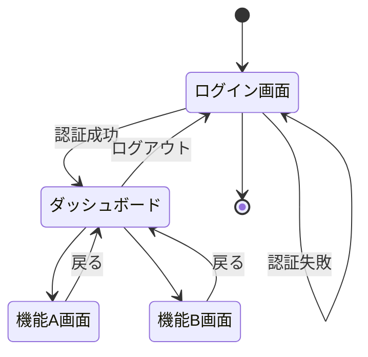

# 機能要件

このセクションでは、システムが提供する機能要件について詳細に記載します。

## 機能一覧

| 機能ID | 機能名 | 概要 | 優先度 |
|--------|-------|------|--------|
| F001 | ログイン機能 | システムへのログイン機能 | 高 |
| F002 | ログアウト機能 | システムからのログアウト機能 | 高 |
| F003 | [機能名] | [概要] | [優先度] |

## 機能詳細

### F001: ログイン機能

#### 概要
ユーザーがシステムにログインするための機能です。

#### 詳細仕様
- F001-01: ユーザーIDとパスワードによる認証
- F001-02: 多要素認証のサポート
- F001-03: パスワードリセット機能
- F001-04: セッション管理
- F001-05: 認証失敗時のエラーメッセージ表示
- F001-06: 認証成功時のダッシュボードリダイレクト

#### ユースケース
- F001-UC01: ユーザーがログイン画面にアクセスする
- F001-UC02: ユーザーIDとパスワードを入力する
- F001-UC03: システムが認証情報を検証する
- F001-UC04: 認証成功時、ダッシュボードにリダイレクトする
- F001-UC05: 認証失敗時、エラーメッセージを表示する

#### 画面イメージ
[ログイン画面のモックアップや設計図を挿入]

#### 制約条件
- F001-C01: パスワードは8文字以上、英数字と特殊文字を含む必要がある
- F001-C02: 5回連続で認証に失敗した場合、アカウントをロックする
- F001-C03: セッション有効期限は8時間とする
- F001-C04: ログイン試行回数は1分間に5回まで制限する

### F002: ログアウト機能

#### 概要
ユーザーがシステムからログアウトするための機能です。

#### 詳細仕様
- F002-01: ログアウトボタンによる明示的なログアウト
- F002-02: セッション無効化処理
- F002-03: ログイン画面への自動リダイレクト
- F002-04: セッションタイムアウトによる自動ログアウト
- F002-05: ログアウト確認ダイアログの表示

#### ユースケース
- F002-UC01: ユーザーがログアウトボタンをクリックする
- F002-UC02: システムが確認ダイアログを表示する
- F002-UC03: ユーザーがログアウトを確認する
- F002-UC04: システムがセッションを無効化する
- F002-UC05: ログイン画面にリダイレクトする

#### 画面イメージ
[ログアウト確認ダイアログのモックアップや設計図を挿入]

#### 制約条件
- F002-C01: ログアウト処理は3秒以内に完了する必要がある
- F002-C02: セッション無効化は確実に実行されなければならない
- F002-C03: ブラウザのキャッシュからも認証情報を削除する
- F002-C04: セッションタイムアウトは8時間とする

### F003: [機能名]

[同様の形式で他の機能についても記載]

## 画面遷移図

## API一覧

| API名 | HTTPメソッド | エンドポイント | 概要 | 関連機能ID |
|-------|-------------|--------------|------|-----------|
| ログインAPI | POST | /api/auth/login | ユーザー認証を行う | F001 |
| ログアウトAPI | POST | /api/auth/logout | ユーザーログアウトを行う | F002 |
| [API名] | [HTTPメソッド] | [エンドポイント] | [概要] | [機能ID] |
