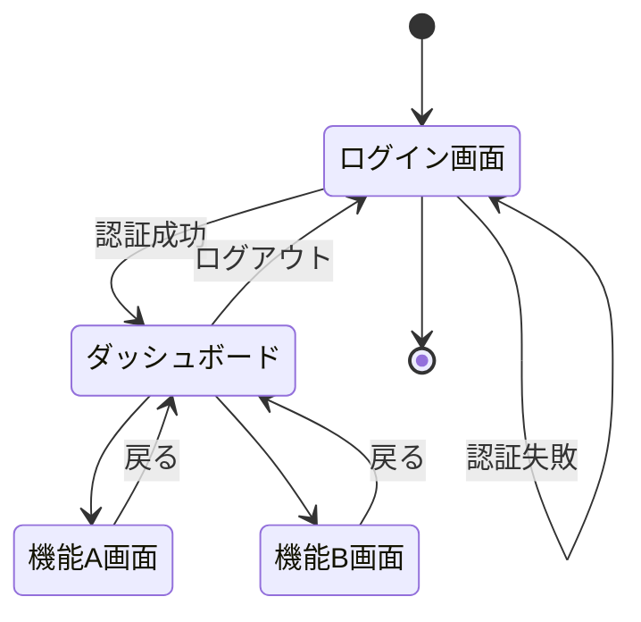

# 機能要件

このセクションでは、システムが提供する機能要件について詳細に記載します。

## 機能一覧

| 機能ID | 機能名 | 概要 | 優先度 |
|--------|-------|------|--------|
| F001 | ユーザー認証 | システムへのログイン・ログアウト機能 | 高 |
| F002 | [機能名] | [概要] | [優先度] |
| F003 | [機能名] | [概要] | [優先度] |

## 機能詳細

### F001: ユーザー認証

#### 概要
ユーザーがシステムにログイン・ログアウトするための機能です。

#### 詳細仕様
- ユーザーIDとパスワードによる認証
- 多要素認証のサポート
- パスワードリセット機能
- セッション管理

#### ユースケース
1. ユーザーがログイン画面にアクセスする
2. ユーザーIDとパスワードを入力する
3. システムが認証情報を検証する
4. 認証成功時、ダッシュボードにリダイレクトする
5. 認証失敗時、エラーメッセージを表示する

#### 画面イメージ
[ログイン画面のモックアップや設計図を挿入]

#### 制約条件
- パスワードは8文字以上、英数字と特殊文字を含む必要がある
- 5回連続で認証に失敗した場合、アカウントをロックする

### F002: [機能名]

[同様の形式で他の機能についても記載]

## 画面遷移図

## API一覧

| API名 | HTTPメソッド | エンドポイント | 概要 |
|-------|-------------|--------------|------|
| ログインAPI | POST | /api/auth/login | ユーザー認証を行う |
| [API名] | [HTTPメソッド] | [エンドポイント] | [概要] |
