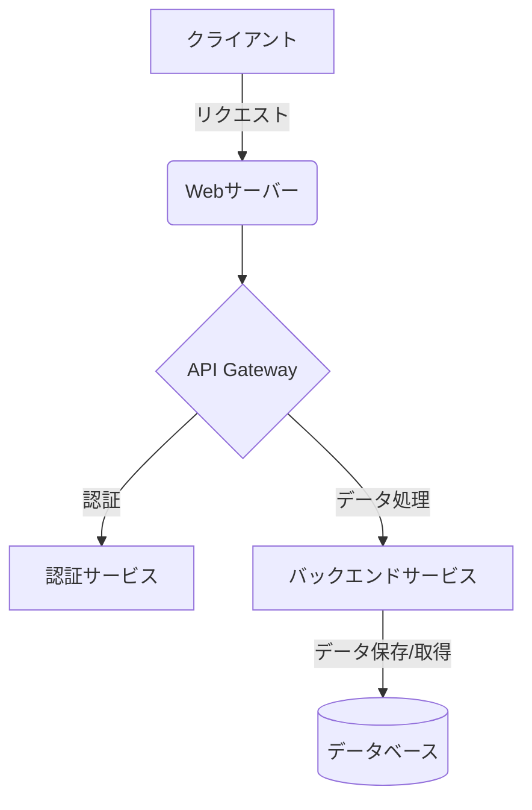

# システム概要

## システムの目的

このシステムは、[システムの主な目的を記載します]。

## 背景

[システム開発の背景や経緯について記載します]

## 全体像

[システムの全体像や主要コンポーネントについて記載します]

### システム構成図

## 主要機能

[システムの主要機能の概要を箇条書きで記載します]

- 機能1
- 機能2
- 機能3

## ユーザー種別

[システムを利用するユーザーの種別と役割について記載します]

| ユーザー種別 | 説明 | 主な利用機能 |
|------------|------|------------|
| 管理者 | システム全体の管理を行うユーザー | ユーザー管理、システム設定 |
| 一般ユーザー | システムの主な機能を利用するユーザー | コンテンツ閲覧、データ入力 |

## 外部システム連携

[外部システムとの連携がある場合、その概要を記載します]

## 前提条件・制約条件

[システム開発における前提条件や制約条件について記載します]
