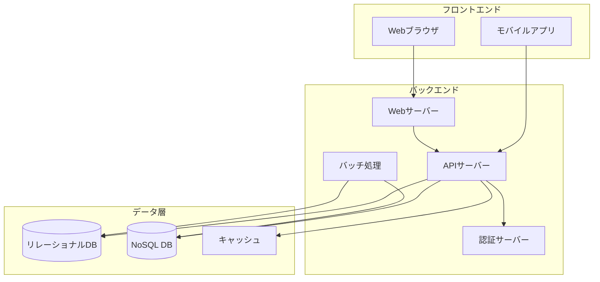
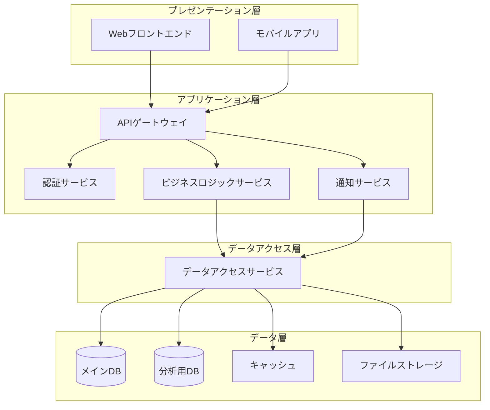
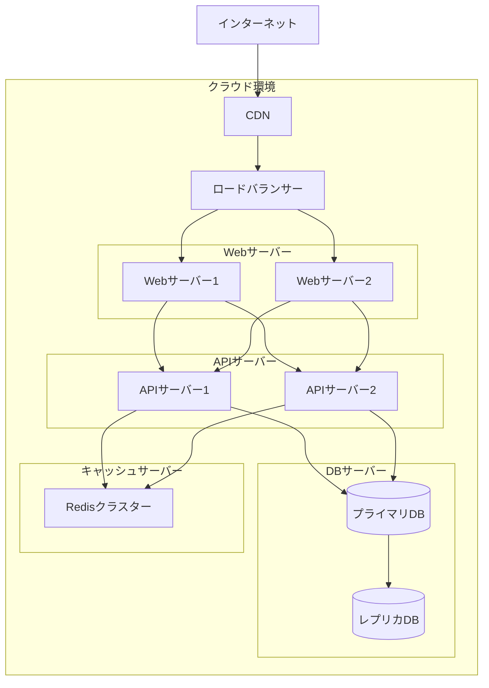

# アーキテクチャ設計

このセクションでは、システムのアーキテクチャ設計について詳細に記載します。

## アーキテクチャ概要

システムは以下の主要コンポーネントで構成されています：

## 技術スタック

### フロントエンド

| 項目 | 採用技術 | バージョン | 選定理由 |
|------|----------|------------|----------|
| UIフレームワーク | React | 18.x | コンポーネント指向の開発が可能、豊富なエコシステム |
| 状態管理 | Redux | 4.x | 予測可能な状態管理、デバッグ容易性 |
| UIコンポーネント | Material UI | 5.x | 一貫したデザイン、豊富なコンポーネント |
| ビルドツール | Vite | 4.x | 高速な開発体験、最適化されたビルド |

### バックエンド

| 項目 | 採用技術 | バージョン | 選定理由 |
|------|----------|------------|----------|
| 言語 | TypeScript | 5.x | 型安全性、開発効率の向上 |
| フレームワーク | NestJS | 10.x | モジュール指向、拡張性の高さ |
| APIスタイル | REST / GraphQL | - | 用途に応じて使い分け |
| 認証 | OAuth 2.0 / JWT | - | 業界標準、セキュリティ確保 |

### データ層

| 項目 | 採用技術 | バージョン | 選定理由 |
|------|----------|------------|----------|
| リレーショナルDB | PostgreSQL | 15.x | 高機能、拡張性、JSON対応 |
| NoSQL DB | MongoDB | 6.x | ドキュメント指向、スケーラビリティ |
| キャッシュ | Redis | 7.x | 高速、多様なデータ構造 |
| ORM | TypeORM | 0.3.x | TypeScriptとの親和性 |

### インフラストラクチャ

| 項目 | 採用技術 | バージョン | 選定理由 |
|------|----------|------------|----------|
| コンテナ化 | Docker | - | 環境の一貫性、移植性 |
| オーケストレーション | Kubernetes | - | スケーラビリティ、自動復旧 |
| CI/CD | GitHub Actions | - | GitHubとの統合、柔軟性 |
| 監視 | Prometheus / Grafana | - | 豊富なメトリクス、可視化 |

## システム構成図

### 論理構成図

### 物理構成図

## セキュリティアーキテクチャ

### ネットワークセキュリティ

- DMZ構成
- WAF（Web Application Firewall）の導入
- VPCによるネットワーク分離

### アプリケーションセキュリティ

- 入力値検証
- SQLインジェクション対策
- XSS対策
- CSRF対策

### データセキュリティ

- 保存データの暗号化
- 通信の暗号化（TLS 1.2以上）
- 機密データのマスキング

## 可用性設計

### 冗長化

- Webサーバー/APIサーバーの冗長化
- データベースのレプリケーション
- マルチAZ配置

### バックアップ戦略

- 日次増分バックアップ
- 週次フルバックアップ
- ポイントインタイムリカバリ

### 障害対策

- 自動フェイルオーバー
- ヘルスチェックと自動復旧
- サーキットブレーカーパターンの実装

## 性能設計

### スケーリング戦略

- 水平スケーリング（スケールアウト）
- 自動スケーリング
- 負荷分散

### キャッシュ戦略

- アプリケーションキャッシュ
- データベースクエリキャッシュ
- CDNによる静的コンテンツのキャッシュ

### データベース最適化

- インデックス設計
- クエリ最適化
- シャーディング戦略
